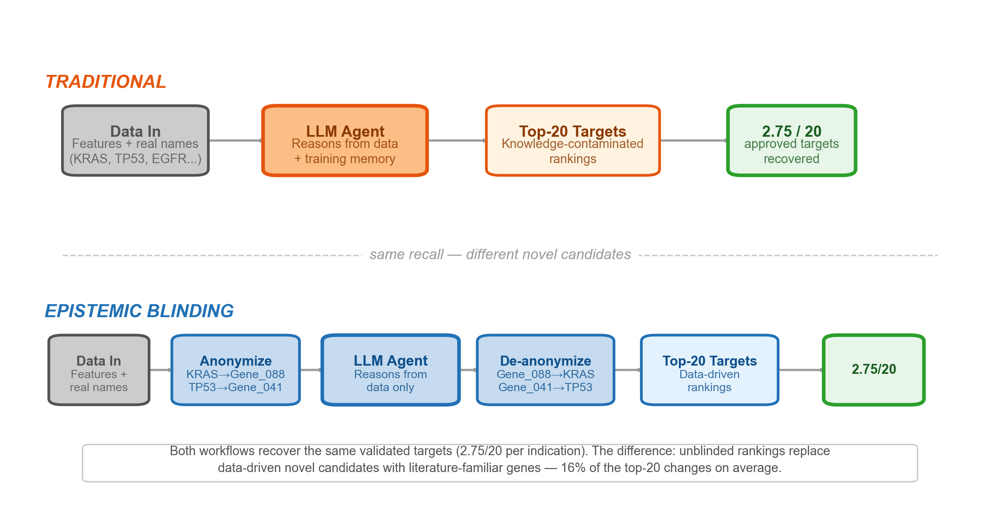

# Epistemic Blinding

**An inference-time protocol for detecting training-prior contamination in LLM-assisted analysis.**

> When we asked an LLM to rank drug targets for colorectal cancer, it put KRAS at #1 and cited "proven therapeutic tractability via covalent RAS inhibitors." When we gave it the identical data with anonymous labels, KRAS dropped to #5. That phrase doesn't appear anywhere in the data. It came from the model's training memory.

Epistemic blinding makes this visible. Replace entity names with anonymous codes, run the analysis, compare against an unblinded control. The delta tells you how much of the output came from your data versus the model's priors.

**Paper:** [Epistemic Blinding: An Inference-Time Protocol for Auditing Prior Contamination in LLM-Assisted Analysis](paper/preprint.md) (Cuccarese, 2026)

---

## Key Results

**Oncology drug target prioritization** (4 cancer types, 100 genes each):
- 16% of top-20 predictions change when gene names are revealed
- Famous genes systematically promoted (PTEN: #15 to #3), obscure data-strong genes demoted (DPP8: #3 to #9)
- Validated target recovery is identical in both conditions

**S&P 500 value screening** (~500 companies, 5 random seeds):
- 35% of top-20 rankings change when tickers are revealed
- Bias is systematic across seeds, not stochastic noise



---

## Quick Start

```bash
pip install pandas pyyaml

# Generate blinded + unblinded prompts from a config
python scripts/blind.py examples/stocks_demo/config.yaml

# Send each prompt to an LLM in separate fresh sessions, save responses, then:
python scripts/compare.py \
    --mapping examples/stocks_demo/output/mapping.json \
    --blinded blinded_response.txt \
    --unblinded unblinded_response.txt \
    --top-k 20 \
    --famous examples/stocks_demo/famous.txt
```

See [examples/stocks_demo/](examples/stocks_demo/) for the full walkthrough.

## How It Works

1. **Write a YAML config** describing your datasets, entity columns, and the analytical task
2. **Run `blind.py`** to produce matched blinded and unblinded prompts + a mapping file
3. **Send each prompt to any LLM** in independent sessions (Claude, GPT, Gemini, local models)
4. **Run `deblind.py`** to resolve anonymous codes back to real names
5. **Run `compare.py`** to quantify the A/B delta (overlap, rank shift, Kendall tau, fame bias)

The tool is model-agnostic: it operates on prompt text, not API internals.

## What This Supports

- **Multi-dataset consistency.** Same entity in two tables gets the same anonymous code
- **Per-column control.** Blind gene names but keep disease names visible
- **Preservation lists.** Keep specific entities un-blinded as anchors
- **Row shuffling.** Prevents positional leakage
- **Reproducible seeds.** Deterministic anonymization for reproducibility

## Examples

| Example | Description | Data |
|---------|-------------|------|
| [stocks_demo](examples/stocks_demo/) | Minimal synthetic example (20 companies) | Included |
| [sp500_value_screen](examples/sp500_value_screen/) | Full S&P 500 fundamentals, 5-seed experiment with results | Included |

The S&P 500 example includes complete blinded/unblinded responses and comparison reports across 5 random seeds, as reported in the paper.

## Claude Code Skill

This tool can also be installed as a Claude Code skill for one-command blinding within agentic workflows:

```bash
# macOS / Linux
ln -s "$(pwd)" ~/.claude/skills/epistemic-blinding

# Windows
mklink /D "%USERPROFILE%\.claude\skills\epistemic-blinding" "%CD%"
```

See [SKILL.md](SKILL.md) for the full skill specification.

## When to Use It

Any time you ask a model to rank, score, or prioritize named entities from a feature table and the entities have uneven representation in the training corpus. In practice this covers most prioritization tasks across:

- Drug discovery and genomics
- Equity analysis and portfolio construction
- Legal case evaluation
- Research paper ranking and peer review
- Hiring and candidate screening
- Policy analysis and intervention evaluation

See [references/when_to_apply.md](references/when_to_apply.md) for detailed decision criteria.

## When NOT to Use It

- Knowledge retrieval ("What does TP53 do?")
- Tasks where names encode functional information (IUPAC chemical names, drug suffixes)
- Literature review where training knowledge is the point
- Datasets where all entities are equally famous

## Citation

```
Cuccarese, M.F. (2026). Epistemic Blinding: An Inference-Time Protocol for
Auditing Prior Contamination in LLM-Assisted Analysis. arXiv preprint.
```

## License

MIT. See [LICENSE](LICENSE).
